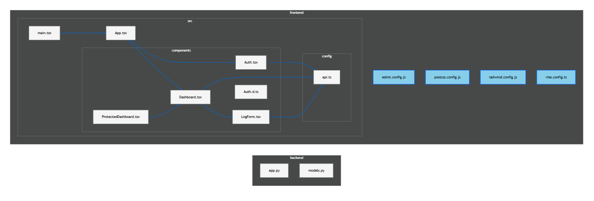
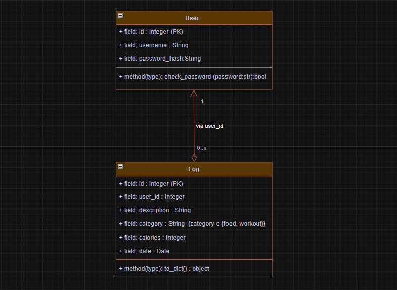

# CalorieDiary - Workout & Calorie Tracker

**CalorieDiary** is a full-stack web application designed to help users track their daily caloric balance efficiently. The system allows seamless logging of both caloric intake (food) and caloric expenditure (workouts), displaying a real-time visual summary of the day's net balance through dynamic charts.

This project was developed as the **Final Project for CS50's Introduction to Computer Science - Harvard University**.

---
## Structure

The project is organized into two main directories:

            calorie-tracker
            ├── backend/
            │   ├── app.py          # Flask app server & REST API endpoints (/api/*)
            │   ├── models.py       # SQLAlchemy models (User, Log) + to_dict/check_password
            │   ├── requirements.txt# Backend dependencies (Flask, SQLAlchemy, CORS, etc.)
            │   └── instance/
            │       └── .gitkeep    # Keeps the SQLite storage folder in git
            │
            ├── frontend/
            │   ├── src/
            │   │   ├── main.tsx       # React entry point (mounts App)
            │   │   ├── App.tsx        # Root component (auth gate + layout)
            │   │   ├── config/
            │   │   │   └── api.ts     # API_URL from VITE_API_URL
            │   │   ├── components/
            │   │   │   ├── Auth.tsx                 # Login/Register UI (POST /api/login, /api/register)
            │   │   │   ├── Dashboard.tsx            # Fetches /summary + /logs, renders charts & list
            │   │   │   ├── LogForm.tsx              # Form that POSTs new logs to /log
            │   │   │   └── ProtectedDashboard.tsx  # React route guard
            │   │   └── index.css                     # Tailwind + global styles/animations
            │   ├── index.html          # Vite HTML template
            │   ├── vite.config.ts     # Vite + React plugin config
            │   ├── tailwind.config.js # Tailwind configuration
            │   ├── postcss.config.js  # PostCSS pipeline config
            │   ├── package.json       # Frontend dependencies/scripts
            │   └── public/
            │       ├── favicon.svg
            │       └── icons.svg
            │
            ├── architecture/
            │   ├── class-diagram.png # Class Diagram of the application
            │   └── codebase-flow.png # Diagram of the frontend↔backend interaction
            │
            └── docker-compose.yml     # Docker orchestration for local development

## Features

* **Authentication:** Password-based Authentication with Server-side Hashing.
* **Real-Time Caloric Balance:** A dashboard showing the total calories consumed (food), workout calories (workout), and the day's net balance.
  - On the backend, the net balance is calculated as `food_total - workout_total`.
  - The frontend validates that `calories` is a positive number.
  - The API aggregates `food_calories` and `workout_calories` by their respective categories and computes the net balance as `food_total - workout_total` (net_balance).
                                                                
* **Interactive Charting:** A PieChart-style proportion graphic that updates when new data is logged.
* **Recent History & Streamlined UX:** A chronological list of the logged-in user's activities, allowing entries to be deleted in real time without reloading the page (SPA behavior).
* **Modern Dark Mode Interface:** A polished, fully responsive UI built using Tailwind CSS utility classes.

---

## Tech Stack

The application strictly separates responsibilities between the Backend (API) and the Frontend (Interface):

### **Backend**
* **Python 3** with **Flask** (Microframework for handling the REST API)
* **Database System:** **SQLite** (for local development) and **PostgreSQL** (for production, configurable via `DATABASE_URL`).

* **Flask-SQLAlchemy** (ORM for database schema management and multi-database abstraction)
* **Flask-CORS** (To handle Cross-Origin Resource Sharing safely between environments)
* **python-dotenv** & **psycopg2-binary** (For environment variable management and PostgreSQL connection)
* **Gunicorn** (Production WSGI server commonly used for deployment)
* **Werkzeug Security** (For cryptographic password hashing and verification)

### **Frontend**
* **React** (Component-based UI library)
* **Vite** (Next-generation, ultra-fast frontend build tool)
* **TypeScript** (For static typing and robust frontend error prevention)
* **Tailwind CSS** (Utility-first CSS framework for layout and styling)
* **Recharts** (Composed React components for data visualization)
* **Fetch API / Axios** (For asynchronous HTTP requests to the Flask API)

### **DevOps & Infrastructure**
* **Docker & Docker Compose** (Containerization for local environment consistency)
* **Deploy Platform** (cloud hosting for the Backend API and/or Frontend)

---

## System Architecture

The application operates as a Single Page Application (SPA). The frontend communicates with the backend exclusively through asynchronous REST API calls. Thanks to the hybrid setup, the API uses a local SQLite file in development and switches to a fully managed PostgreSQL database in production without modifying codebase logic.

---

## Class Diagram

The conceptual domain model illustrating the structure, attributes, and relationships of the system's core data models (e.g., Users and Logs):

---

## User Flow

1. Register an account
2. Log in
3. Create food logs
4. Create workout logs
5. View net caloric balance
6. Delete entries if necessary

---

## Documentation

Additional documentation is available in the `docs/` directory:

- [API Reference](docs/api.md)
- [Environment Configuration](docs/setup.md)
- [Codebase Overview](docs/codebase.md)